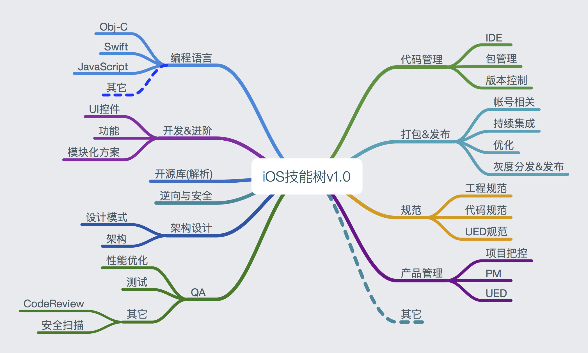

# iOS开发手册

## 提要
* 手册目的(smart)
* [gitbook地址](https://www.gitbook.com/book/panzhow/ios-1127/details)

## 花名册

开发人员  | 站点| 其它 |
--- | --- | --- |
|[panzhow]()| 微信公众号| 尚无
| 待追加

## 贡献方式

1. 搜索并添加微信（**），入伙花名册，一起完善该手册。
2. `pull request` 足下高作至[手册Github](https://github.com/PanZhow/iOS_notebook)。

	> 1. Master分支锁定
	> 2. 提交至Dev分支
	> 3. review 、 合并操作 
	
3. 想得到的其它任意途径均可。

## 文章来源及格式

### Ⅰ. 投递来源

1. 自己原创。
2. 技术网站、公众号、简书、各大博客等优质文章均可。

### Ⅱ. 投递格式

1. Markdown格式的文章（推荐）。
	
	> 文章头部标有作者信息（姓名、微信、简书、公众号等）
	
2. 直接以文章外接、或者其它任意方式投递均可。

附：因文章入库格式为markdown，故而推荐。若含有图片等资源，最好以单一文件夹的方式管理。
	

## 手册大纲

