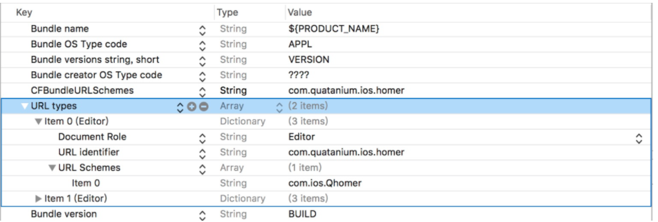

https://lpd-ios.github.io/2017/02/26/iOS-Router/


1. 纵向的会进行分层，网络层，UI层，数据持久层。每一层横向的也会根据业务进行组件化。尽管这样做了以后会让开发更加有效率，更加好维护，但是如何解耦各层，解耦各个界面和各个组件，降低各个组件之间的耦合度，如何能让整个系统不管多么复杂的情况下都能保持“高内聚，低耦合”的特点，才是重中之重。

2. App路由能解决哪些问题

	1. 3D-Touch功能或者点击推送消息，要求外部跳转到App内部一个很深层次的一个界面。
	2. 自家的一系列App之间如何相互跳转？
	3. 如何解除App组件之间和App页面之间的耦合性
	4. 如何能统一iOS和Android两端的页面跳转逻辑？甚至如何能统一三端的请求资源的方式：项目里面某些模块会混合ReactNative，Weex，H5界面，这些界面还会调用Native的界面，以及Native的组件。那么，如何能统一Web端和Native端请求资源的方式
	5. 动态下发配置文件来配置App的跳转逻辑，那么如果做到iOS和Android两边只要共用一套配置文件
	6. 如果App出现bug了，如何不用JSPatch，就能做到简单的热修复功能：比如App上线突然遇到了紧急bug，能否把页面动态降级成H5，ReactNative，Weex？或者是直接换成一个本地的错误界面
	7. 如何在每个组件间调用和页面跳转时都进行埋点统计？每个跳转的地方都手写代码埋点？利用Runtime AOP 
	8. 如何在每个组件间调用的过程中，加入调用的逻辑检查，令牌机制，配合灰度进行风控逻辑
	9. 如何在App任何界面都可以调用同一个界面或者同一个组件？只能在AppDelegate里面注册单例来实现

----

## APP之间跳转实现
1. URL Scheme方式实现

	> mailto://**@email.com   打开邮箱
	> 
	> tel://123       拨打电话

	1. iOS9之前在App的info.plist中添加如下，即可实现在safari中跳转至该App中。

		1. 
	
		2. Safari中：
	
			> com.ios.Qhomer://即可打开该App中
			
		3. 某些App不希望任意其它app都可打开自身，故做检测如下

			```
			- (BOOL)application:(UIApplication *)application
            openURL:(NSURL *)url
  sourceApplication:(NSString *)sourceApplication
         annotation:(id)annotation
{
    NSLog(@"sourceApplication: %@", sourceApplication);
    NSLog(@"URL scheme:%@", [url scheme]);
    NSLog(@"URL query: %@", [url query]);
    //
    if ([sourceApplication isEqualToString:@"com.tencent.weixin"]){
        // 允许打开
        return YES;
    }else{
        return NO;
    }
}
			```
	2. Universal Links方式


---


## App内组件间路由设计
 	
1. App内部的路由设计，主要需要解决2个问题：

	> 1. 各个页面和组件之间的跳转问题。
	> 2. 各个组件之间相互调用。