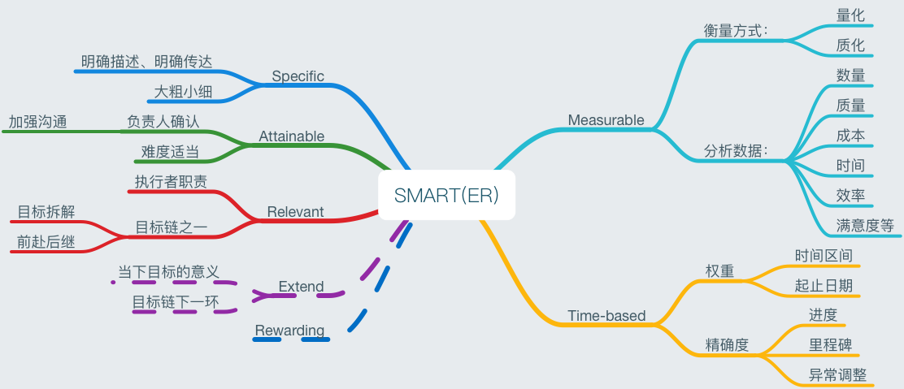

# 术语解读

## 目录

1. SMART原则
2. TODO

## 一、SMART原则

### 1.0 图解

### 1.1 概念

1. S：Specific

	> * 目标需用`明确的`语言表达清晰。
	> * 目标需能`明确的`传达至相关成员。
	> * 大粗小细：大目标，粒度大些；小目标，粒度要小。
	
2. M：Measurable

	> * 目标需是可以以`量化`或`质化`衡量的。
	> * 一般伴有分析数据。如数量、质量、成本、时间、满意度
	
3. A：Attainable

	> * 目标需与直接负责人共同确认，确保是可以`实现的`。
	> * 加强沟通。
	
4. R：Relevant

	> * 目标是与职责直接`相关联`的。
	> * 目标不是孤岛，它的实现也是具有目的性的。
	
5. T：Time-based

	> * 根据目标的权重，确定其时间区间，起止日期。
	> * 目标进度、里程碑、异常变更调整等是其属性。
	> * 时间把控的精确度和经验成正比
	
	
### 1.2 其它

1. `目标管理`首次出现在管理学大师Peter Drucker的《管理实践》一书中。
2. SMART目的：有效进行成员组织和目标的制定和控制。

## 二、TODO